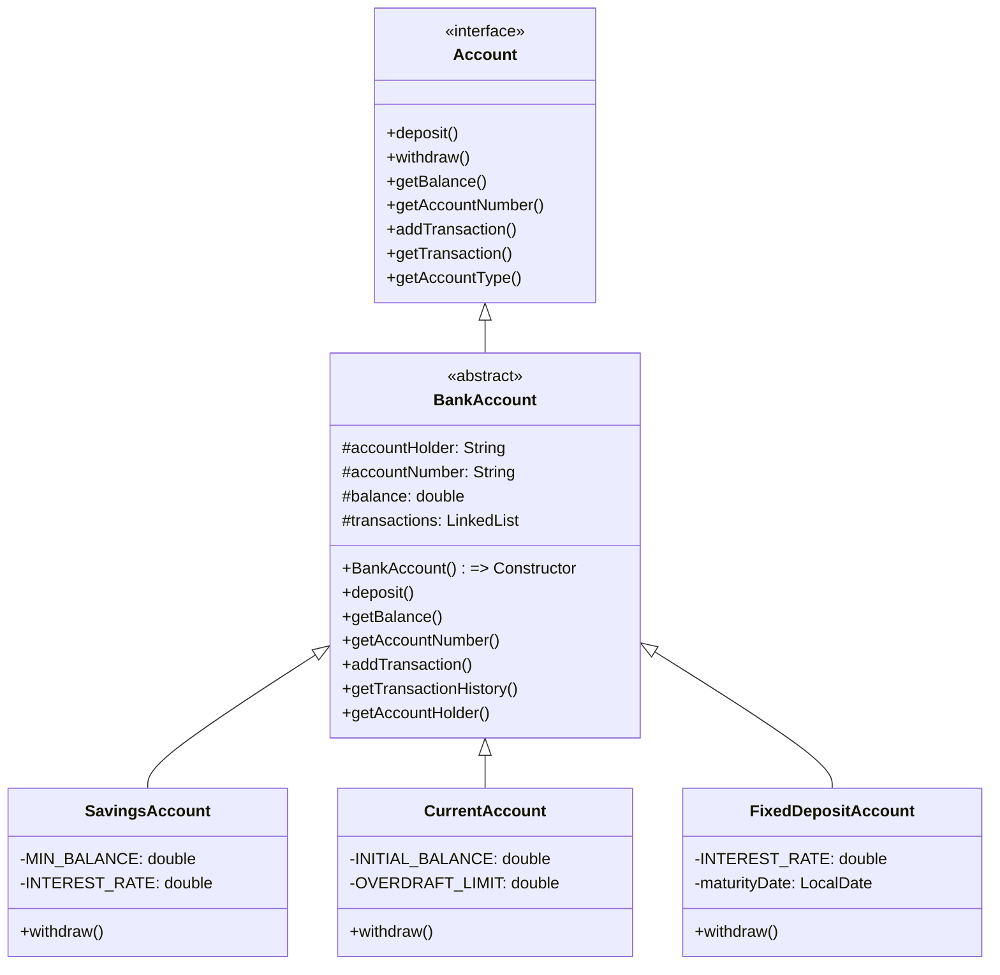

---

# 🏦 Bank Account Management System

A JavaFX-based banking application that simulates different account types (Savings, Current, Fixed Deposit) with transaction processing, history tracking, and OOP principles.

## ✨ Features

- **Account Management**
  - Create and manage **Savings**, **Current**, and **Fixed Deposit** accounts
  - Unique rules per account type (minimum balance, overdrafts, maturity dates)
- **Transactions**
  - Deposit/withdraw with polymorphic behavior
  - Balance inquiries
- **Transaction History**
  - Linked-list implementation for efficient record-keeping
  - View last N transactions
- **OOP Implementation**
  - Interfaces for banking operations
  - Abstract base class for accounts
  - Constructor chaining for initialization
- **JavaFX UI**
  - Interactive account management
  - Real-time transaction display
  - Event-driven operations

## 📋 Account Types

| Type | Features |
|------|----------|
| **Savings** | Minimum balance requirement • No overdrafts • Interest accrual |
| **Current** | Overdraft allowance (up to limit) • Frequent transactions |
| **Fixed Deposit** | Locked until maturity • Higher interest rates • No early withdrawals |

## 🛠️ Technical Implementation



## 🚀 Getting Started

### Prerequisites
- Java JDK 17+
- JavaFX SDK
- Maven

### Installation
```bash
git clone https://github.com/thenoblet/bms.git
cd bms
mvn clean install
```

### Running the Application
```bash
mvn javafx:run
```

## UI Preview🖥️


## 📝 Lab Objectives Achieved
- ✅ OOP Principles (Inheritance, Polymorphism, Abstraction)
- ✅ Linked List transaction history
- ✅ JavaFX interactive interface
- ✅ Constructor chaining and `this` keyword usage
- ✅ Dynamic account behaviors via method overriding

## 📜 License
MIT

---
